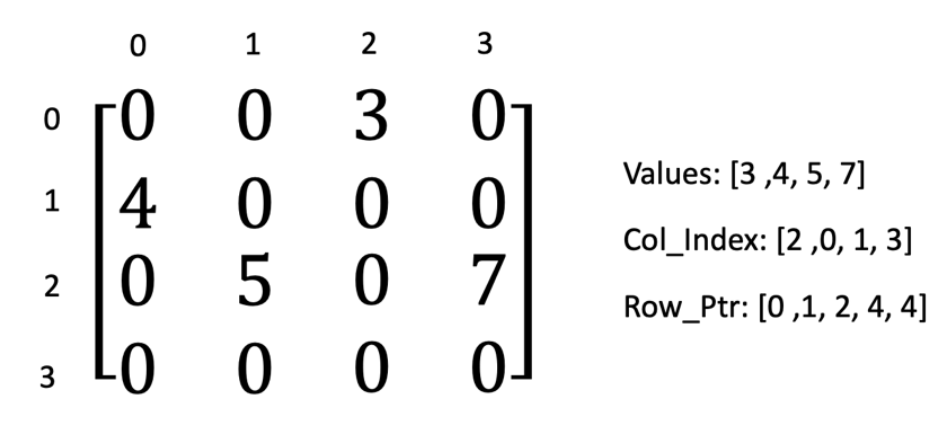
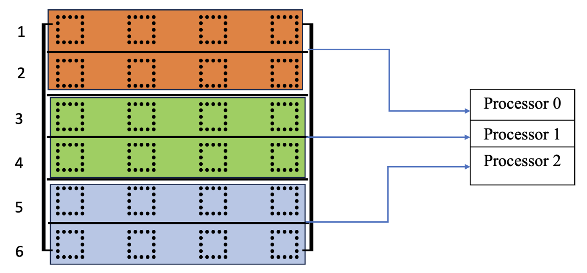
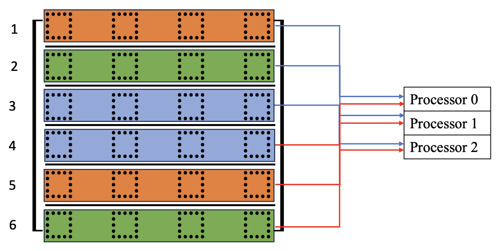
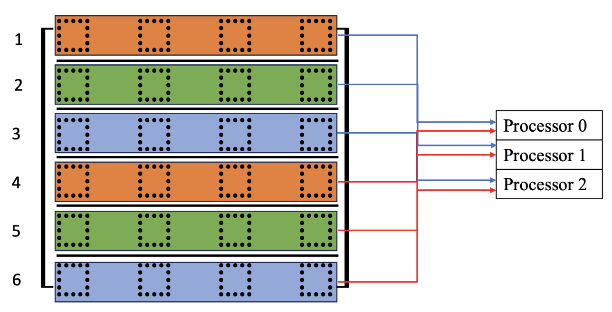

# High-Performarce-Computing: Parallel Programming Approaches to Sparse Matrix-Fat Vector Multiplication
## Project Overview
This project focuses on leveraging High-Performance Computing (HPC) techniques to solve the problem of sparse matrix-vector multiplication using parallel processing. The project implements and compares three parallel algorithms using MPI (Message Passing Interface) and evaluates their performance against a serial implementation.

High-Performance Computing (HPC) involves the use of supercomputers and parallel processing techniques to solve complex computational problems at high speeds. By distributing tasks across multiple processors, HPC systems can handle large datasets and computational workloads more efficiently than traditional computing methods.

## Problem: Sparse Matrix-Fat Vector Multiplication
Sparse matrices are common in scientific computing, where most of the elements in the matrix are zero. The objective of this project is to efficiently multiply a sparse matrix stored in Compressed Sparse Row (CSR) format with a dense vector using parallel algorithms.

## Parallel Algorithms Implemented
Three parallel algorithms have been implemented and analyzed for performance comparison:

1. Row Block Parallel Algorithm
In this algorithm, the sparse matrix is divided into equal-sized blocks of rows, with each process handling one block.
Each process performs the matrix-vector multiplication independently for its assigned block, and the results are then communicated to other processes.
Communication Model: This algorithm primarily uses point-to-point communication via MPI_Send and MPI_Recv to exchange the results between processes.

2. Row-Wise Parallel Algorithm
In this method, the rows of the sparse matrix are distributed across all available processes. Each process is responsible for computing its assigned rows and contributing to the final result.
This method distributes the computation evenly but requires frequent synchronization.
Communication Model: Point-to-point communication is used for inter-process communication, but collective operations like MPI_Reduce may be used to aggregate the results.

3. Striped Parallel Algorithm
In the striped algorithm, rows are distributed in a round-robin fashion across all processes, with each process handling a subset of the rows in a distributed manner.
This reduces load imbalance and makes better use of available processors.
Communication Model: This method heavily relies on collective communication, such as MPI_Bcast to distribute vector data to all processes and MPI_Reduce to gather the final results efficiently.

Communication Models
1. Point-to-Point Communication:
Point-to-point communication refers to direct data transfer between two specific processes. This is implemented using MPI_Send (to send data) and MPI_Recv (to receive data).
Example: In the Row Block Parallel Algorithm, each process sends its results to a root process or other processes, facilitating efficient data exchange for smaller subsets of rows.
2. Collective Communication:
Collective communication involves communication across all processes in the communicator. Functions like MPI_Bcast (for broadcasting data) and MPI_Reduce (for reducing and gathering results) are examples of collective operations.
Example: In the Striped Parallel Algorithm, collective communication (MPI_Bcast) is used to send the dense vector to all processes, allowing them to compute in parallel without waiting for other processes to finish their part.
Objectives
Implement and compare three parallel algorithms for sparse matrix-vector multiplication.
Analyze the impact of communication models (point-to-point vs. collective) on performance.
Evaluate performance gains of parallel algorithms compared to the serial version using metrics such as speed-up and communication overhead.
Results & Discussion
The results indicate that:

All three parallel algorithms achieved significant speedup over the serial implementation.
The Striped Parallel Algorithm, which used collective communication, showed the best performance on large-scale datasets due to reduced communication overhead and better load balancing.
Point-to-point communication was more efficient in smaller datasets, where direct communication between fewer processes minimized synchronization delays.
